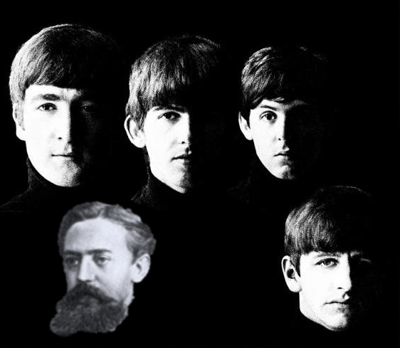

# The Fifth Beatle

This repository contains a project where I wanted to explore [Markov Chains](https://en.wikipedia.org/wiki/Markov_chain) to Generate Chord Progressions in the Style of The Beatles.

There are two main parts of this project, each separated into their own Python file. In this repo I only attached the one called generate_chords.py, since it contains the main meat and potatoes of the project. If you want more info on scrapping please visit [Beautiful Soups Documenatation](https://www.crummy.com/software/BeautifulSoup/bs4/doc/). 

generate_chords.py, reads in a CSV file of chord progression data (like the_beatles_chords.csv) and analyzes it so it can generate chord progressions in a similar style. In its current state, this program analyzes the chord movements of The Beatles, keeping track of what movements they typically make. For example, if they're writing in the key of C major, and they just played an E minor chord, what chord would The Beatles typically choose next? The data shows they'll likely move to an A minor, D minor seventh, or G major chord. 

This program keeps track of all potential chord movements of The Beatles in a ‘transition state matrix’, which in layperson’s terms is a table of numbers that can find the probability of a next chord given the current chord. This method allows for ‘chaining’ of chord predictions (i.e. Markov Chains), which allows it to generate full chord progressions from a single start chord. As its currently set up, Chord_Scraping.py will produce ten chord progressions in the style of The Beatles in both a major and minor key. I’ve included a CSV with the web-scraped chord progression data for The Beatles in this repository, named ‘the_beatles_chords.csv’.

<h3>Running This Program</h3>

To run this program, you must download generate_chords.py and the dataset which you can find in /data/the_beatles_chords.csv

The modules necessary to run generate_chords.py are common, many of which are default libraries. You'll need:

<ul>
<li>Collections</li>
<li>CSV</li>
<li>Numpy</li>
<li>Pandas</li>
<li>Random</li>
</ul>

To run generate_chords.py, you must specify the path of the CSV file with chord progression data, and then you are ready to Rock n Roll.
<h3>Some Examples</h3>

In its current state, the program outputs ten chord progressions in both a major and minor key in the style of The Beatles. Below is an example of this output.

  

There's a lot that goes into creating a Beatles-style song, and the chord progression is just one part of it. Many of their top songs (such as Hey Jude or Paperback Writer) feature simple, traditional pop chord progressions, while others (such as Martha My Dear) feature more 'interesting' and 'colorful' chords. I've found two to three chord progressions for every ten generated by this program work well and carry a stylistic influence of The Beatles.

From the output above, I found the [fourth major key chord progression](https://soundcloud.com/user-756588720/major-progression-example/s-Q9LKIETPRIf) and the [second minor key chord progression](https://soundcloud.com/user-756588720/minor-progression-example-2/s-gU94XnnMNIk) sounded the best to my ears. 

